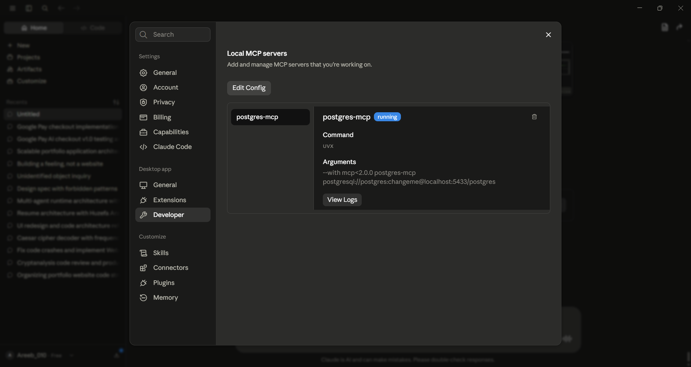
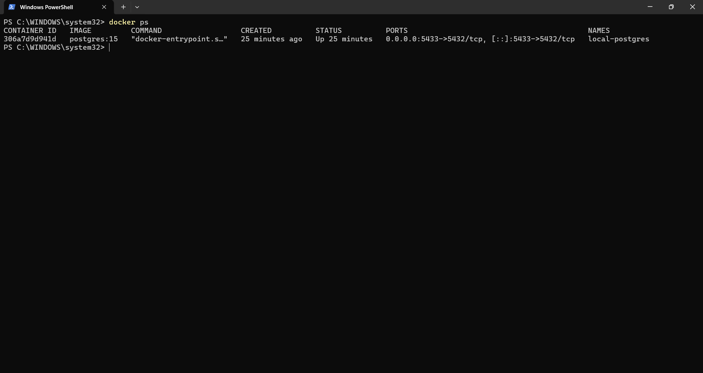
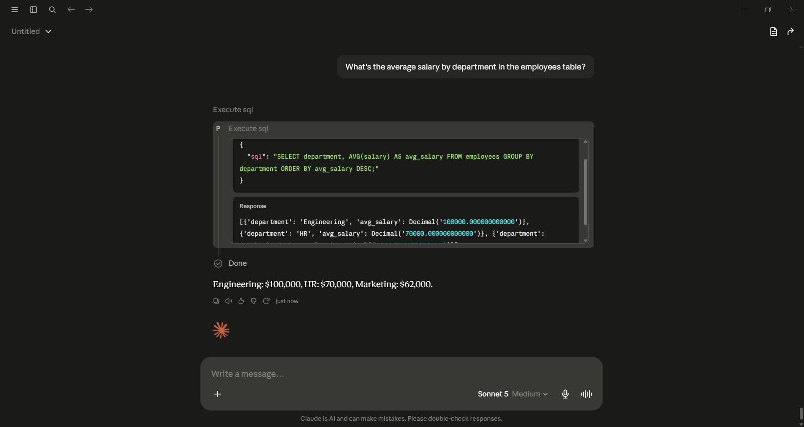
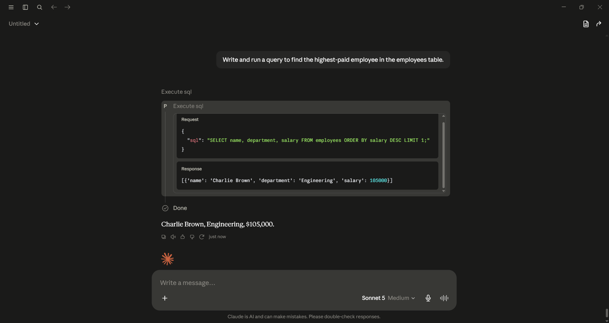

# Local Postgres + MCP Integration

Connecting an AI assistant to a local PostgreSQL database via the Model Context Protocol (MCP) — two configurations: a cloud-model version (Claude Desktop) and a fully local, offline version (Ollama).

Built as part of an internship project. Full build log and design decisions: see [PLAN.md](./PLAN.md).

## Architecture

**Phase 1 — Docker + Claude Desktop**
```
Claude Desktop  --MCP (stdio, via uvx)-->  postgres-mcp  --SQL-->  Postgres (Docker, port 5433)
```

**Phase 2 — Fully local with Ollama**
```
Ollama (local LLM)  --MCP-->  postgres-mcp (Docker)  --SQL-->  Postgres (Docker, local)
```

## Status

- [x] Plan written
- [x] Phase 1: Docker + Claude Desktop — **working**, validated end-to-end
- [ ] Phase 2: Ollama, fully local — not started

## Quick Start (Phase 1, Windows)

1. Make sure Docker Desktop is running (`docker ps` should return without error).
2. Copy `.env.example` to `.env` and set a real password.
3. Start the database: `.\scripts\phase1_start_db.ps1` (starts Postgres on **port 5433** — see Gotchas below for why not 5432).
4. Seed the schema:
   ```powershell
   Get-Content sql\phase1_employees_schema.sql | docker exec -i local-postgres psql -U postgres -d postgres
   ```
5. Open Claude Desktop → **Settings → Developer → Edit Config**. This opens the real config file directly — on Windows, packaged-app installs of Claude Desktop do **not** use the usual `%APPDATA%\Claude\` path; the actual file lives under
   `AppData\Local\Packages\<package-id>\LocalCache\Roaming\Claude\claude_desktop_config.json`.
   Add the contents of `config/claude_desktop_config.phase1.example.json` to the `mcpServers` key, filling in your real password.
6. Fully quit and reopen Claude Desktop (system tray → Quit, not just closing the window).
7. In Settings → Developer, confirm `postgres-mcp` shows status **running**.
8. Try it in a chat: *"What columns does the employees table have?"*

## Validation Screenshots

Live end-to-end proof the MCP connection works — each prompt below was run directly in Claude Desktop, with the tool-call panel visible showing a real query against the live database.

**Connection status**
[](docs/screenshots/phase1_connected_badge.png)

**Container running**
[](docs/screenshots/phase1_docker_ps.png)

**Prompt 1 — Schema discovery:** *"What columns does the employees table have?"*
[](docs/screenshots/phase1_query_schema.png)

**Prompt 2 — Aggregation:** *"What's the average salary by department in the employees table?"*
[](docs/screenshots/phase1_query_aggregation.png)

**Prompt 3 — Query generation:** *"Write and run a query to find the highest-paid employee in the employees table."*
[](docs/screenshots/phase1_query_topquery.png)

**Prompt 4 — Code generation:** *"Write a Python script that pulls data from this database and plots a bar chart of salaries grouped by employee name."*
[](docs/screenshots/phase1_query_codegen.png)

## Gotchas (found the hard way)

Documenting these because the original setup guide didn't cover any of them, and each one cost real debugging time:

- **`openmcpserver/mcp-postgres:latest`** (the image named in the original setup guide) runs an HTTP server (Uvicorn) instead of communicating over stdio. Claude Desktop's local MCP servers require stdio, so this image doesn't work for this use case at all — confirmed via a manual `docker run` test showing it bind to an HTTP port instead of starting a stdio process.

- **`@modelcontextprotocol/server-postgres`** (the official npm package) is deprecated as of mid-2026 and no longer supported.

- **`@crystaldba/postgres-mcp`** doesn't exist on npm — it's a Python package (`postgres-mcp` on PyPI), meant to be run with `uvx`, not `npx`.

- **`uvx postgres-mcp ...` crashed** with `ModuleNotFoundError: No module named 'mcp.server.fastmcp'`. Root cause: the upstream `mcp` Python SDK released a breaking `2.0.0` in late July 2026 that renamed `FastMCP` to `MCPServer` and moved the module entirely. `postgres-mcp` has no upper version bound on its `mcp` dependency, so `uvx` resolved the new breaking version by default.
  **Fix** — pin the dependency at invocation time:
  ```
  uvx --with "mcp<2.0.0" postgres-mcp "postgresql://..."
  ```

- **Password authentication kept failing even with the correct Docker password.** Turned out a **native Windows Postgres service** (installed by an unrelated tool) was also listening on port 5432, silently intercepting TCP connections before they reached the Docker container — confirmed via `netstat -ano | findstr :5432` showing two distinct listening PIDs, and `tasklist` showing one of them was `postgres.exe` running as a Windows Service, not part of Docker.
  **Fix** — remapped the container to **port 5433** instead of fighting for 5432.

- `POSTGRES_PASSWORD` only takes effect the *first* time a container's data volume is initialized. If auth fails against a container you're sure has the right env var, check whether the volume predates that env var — `ALTER USER postgres WITH PASSWORD '...'` from inside the container (via `docker exec`) can resync it without a full rebuild.

## Security Notes

- `POSTGRES_READ_ONLY` (Phase 2 guide) is enforced at the MCP wrapper level, not by Postgres itself — a more rigorous setup would use a dedicated read-only Postgres role via `GRANT SELECT`.
- No real credentials are committed — see `.env.example` and `.gitignore`.
- See [PLAN.md](./PLAN.md) Section 8 for the full security write-up.

## License

MIT (or update as preferred).
