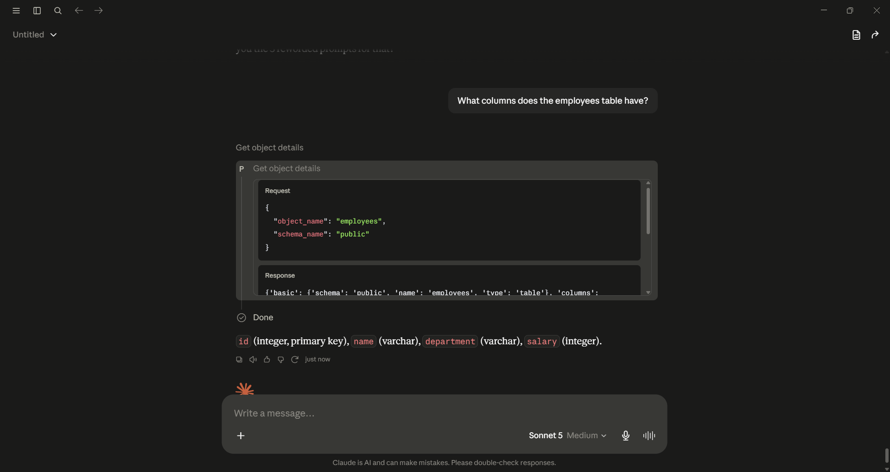
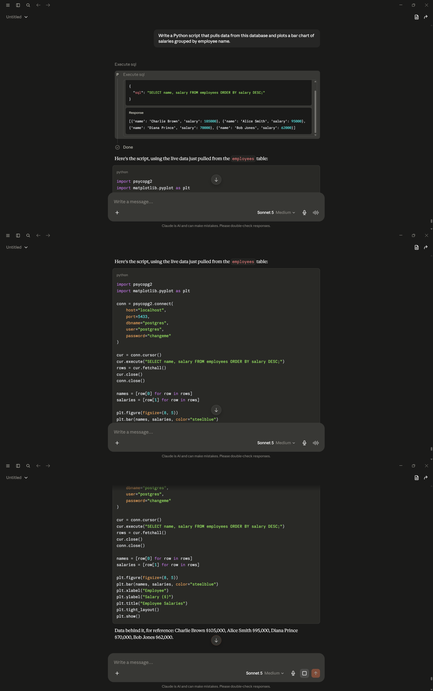
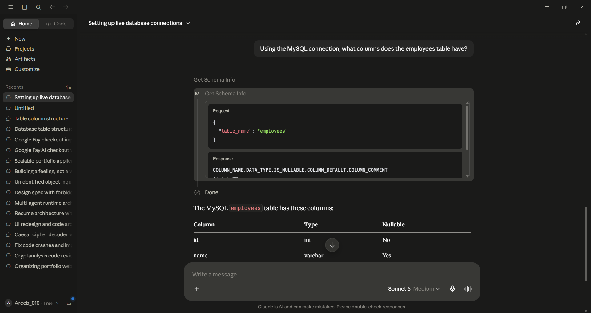
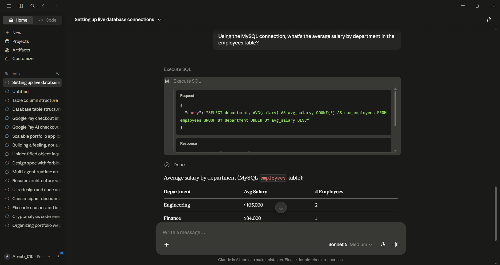
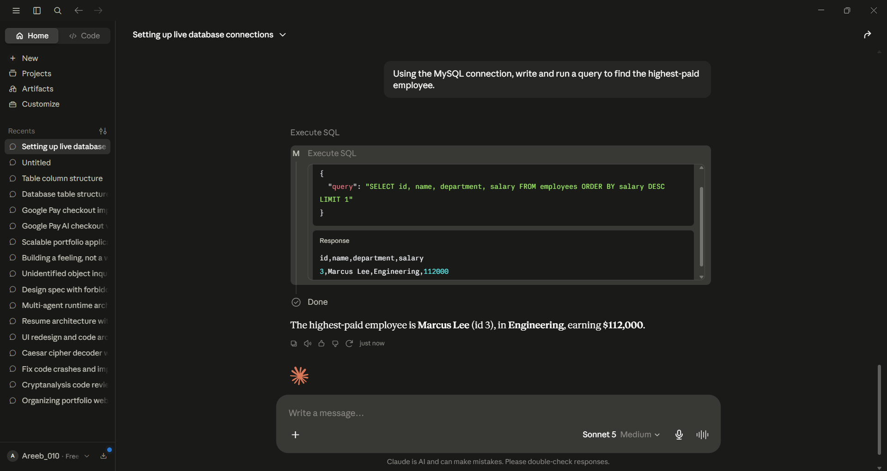
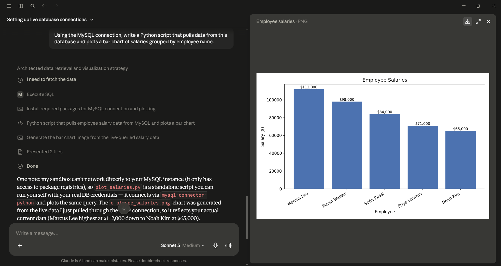

# Local Postgres + MCP Integration

Connecting an AI assistant to a local PostgreSQL database via the Model Context Protocol (MCP) — two configurations: a cloud-model version (Claude Desktop) and a fully local, offline version (Ollama).

Built as part of an internship project. Full build log and design decisions: see [PLAN.md](./PLAN.md).

## Architecture

**Phase 1a — Docker + Claude Desktop (PostgreSQL)**
```
Claude Desktop  --MCP (stdio, via uvx)-->  postgres-mcp  --SQL-->  Postgres (Docker, port 5433)
```

**Phase 1b — Docker + Claude Desktop (MySQL)**
```
Claude Desktop  --MCP (stdio, via uvx)-->  mysql-mcp  --SQL-->  MySQL (Docker, port 3306)
```

**Phase 1c — Docker + Claude Desktop (MS SQL Server)**
```
Claude Desktop  --MCP (stdio, via pip-installed sql-mcp-server)-->  sql-assistant  --SQL-->  SQL Server (Docker, port 1433)
```

**Phase 1d — Claude Desktop (SQLite)**
```
Claude Desktop  --MCP (stdio, via uvx)-->  sqlite-mcp  --SQL-->  SQLite (local file, no container)
```

**Phase 2 — Fully local with Ollama**
```
Ollama (local LLM)  --MCP-->  postgres-mcp (Docker)  --SQL-->  Postgres (Docker, local)
```

## Status

- [x] Plan written
- [x] Phase 1a: Docker + Claude Desktop (PostgreSQL) — **working**, validated end-to-end
- [x] Phase 1b: Docker + Claude Desktop (MySQL) — **working**, validated end-to-end
- [ ] Phase 1c: Docker + Claude Desktop (MS SQL Server) — setup documented, screenshots pending
- [ ] Phase 1d: Claude Desktop (SQLite) — setup documented, screenshots pending
- [ ] Phase 2: Ollama, fully local — not started

## Quick Start — Phase 1a: Docker + Claude Desktop (PostgreSQL, Windows)

1. Make sure Docker Desktop is running (`docker ps` should return without error).
2. Copy `.env.example` to `.env` and set a real password.
3. Start the database: `.\scripts\phase1_start_db.ps1` (starts Postgres on **port 5433** — see Gotchas below for why not 5432).
4. Seed the schema:
   ```powershell
   Get-Content sql\postgres\phase1_employees_schema.sql | docker exec -i local-postgres psql -U postgres -d postgres
   ```
5. Open Claude Desktop → **Settings → Developer → Edit Config**. This opens the real config file directly — on Windows, packaged-app installs of Claude Desktop do **not** use the usual `%APPDATA%\Claude\` path; the actual file lives under
   `AppData\Local\Packages\<package-id>\LocalCache\Roaming\Claude\claude_desktop_config.json`.
   Add the contents of `config/postgres/claude_desktop_config.example.json` to the `mcpServers` key, filling in your real password.
6. Fully quit and reopen Claude Desktop (system tray → Quit, not just closing the window).
7. In Settings → Developer, confirm `postgres-mcp` shows status **running**.
8. Try it in a chat: *"What columns does the employees table have?"*

## Validation Screenshots

Live end-to-end proof the MCP connection works — each prompt below was run directly in Claude Desktop, with the tool-call panel visible showing a real query against the live database.

**Connection status**
[](docs/screenshots/postgres/phase1_connected_badge.png)

**Container running**
[](docs/screenshots/postgres/phase1_docker_ps.png)

**Prompt 1 — Schema discovery:** *"What columns does the employees table have?"*
[](docs/screenshots/postgres/phase1_query_schema.png)

**Prompt 2 — Aggregation:** *"What's the average salary by department in the employees table?"*
[](docs/screenshots/postgres/phase1_query_aggregation.png)

**Prompt 3 — Query generation:** *"Write and run a query to find the highest-paid employee in the employees table."*
[](docs/screenshots/postgres/phase1_query_topquery.png)

**Prompt 4 — Code generation:** *"Write a Python script that pulls data from this database and plots a bar chart of salaries grouped by employee name."*
[](docs/screenshots/postgres/phase1_query_codegen.png)

## Gotchas (found the hard way)

Documenting these because the original setup guide didn't cover any of them, and each one cost real debugging time:

- **`openmcpserver/mcp-postgres:latest`** (the image named in the original setup guide) runs an HTTP server (Uvicorn) instead of communicating over stdio. Claude Desktop's local MCP servers require stdio, so this image doesn't work for this use case at all — confirmed via a manual `docker run` test showing it bind to an HTTP port instead of starting a stdio process.

- **`@modelcontextprotocol/server-postgres`** (the official npm package) is deprecated as of mid-2026 and no longer supported.

- **`@crystaldba/postgres-mcp`** doesn't exist on npm — it's a Python package (`postgres-mcp` on PyPI), meant to be run with `uvx`, not `npx`.

- **`uvx postgres-mcp ...` crashed** with `ModuleNotFoundError: No module named 'mcp.server.fastmcp'`. Root cause: the upstream `mcp` Python SDK released a breaking `2.0.0` in late July 2026 that renamed `FastMCP` to `MCPServer` and moved the module entirely. `postgres-mcp` has no upper version bound on its `mcp` dependency, so `uvx` resolved the new breaking version by default.
  **Fix** — pin the dependency at invocation time:
  ```
  uvx --with "mcp<2.0.0" postgres-mcp "postgresql://..."
  ```

- **Password authentication kept failing even with the correct Docker password.** Turned out a **native Windows Postgres service** (installed by an unrelated tool) was also listening on port 5432, silently intercepting TCP connections before they reached the Docker container — confirmed via `netstat -ano | findstr :5432` showing two distinct listening PIDs, and `tasklist` showing one of them was `postgres.exe` running as a Windows Service, not part of Docker.
  **Fix** — remapped the container to **port 5433** instead of fighting for 5432.

- `POSTGRES_PASSWORD` only takes effect the *first* time a container's data volume is initialized. If auth fails against a container you're sure has the right env var, check whether the volume predates that env var — `ALTER USER postgres WITH PASSWORD '...'` from inside the container (via `docker exec`) can resync it without a full rebuild.

## MySQL Implementation — Phase 1b: Docker + Claude Desktop (MySQL)

The same guide, implemented a second time against MySQL instead of Postgres — same architecture pattern, run side by side with the Postgres setup above (both MCP connections can be active in Claude Desktop at once).

**Architecture**
```
Claude Desktop  --MCP (stdio, via uvx)-->  mysql-mcp  --SQL-->  MySQL (Docker, port 3306)
```

**Setup**

1. Start the MySQL container:
   ```powershell
   docker run -d --name local-mysql -e MYSQL_ROOT_PASSWORD=changeme -e MYSQL_DATABASE=testdb -p 3306:3306 mysql:8
   ```
   Give it ~30 seconds to finish initializing before connecting.

2. Seed the schema:
   ```powershell
   docker exec -i local-mysql mysql -uroot -pchangeme testdb < sql\mysql\employees_schema.sql
   ```
   (Uses a different sample dataset from the Postgres version — Ethan Walker, Priya Sharma, Marcus Lee, Sofia Rossi, Noah Kim — deliberately, to keep the two databases visibly distinct when testing both at once.)

3. Add the contents of `config/mysql/claude_desktop_config.example.json` to the `mcpServers` key in Claude Desktop's config, alongside the existing `postgres-mcp` entry — don't remove it, both run independently.

4. Fully quit and reopen Claude Desktop, confirm `mysql-mcp` shows status **running** in Settings → Developer.

5. Since two databases are connected at once, be explicit about which one a prompt should hit, e.g. *"Using the MySQL connection, what columns does the employees table have?"*

**Validation**

The same 4 prompts from the original guide, run live against MySQL:

[](docs/screenshots/mysql/mysql_query_schema.png)
[](docs/screenshots/mysql/mysql_query_aggregation.png)
[](docs/screenshots/mysql/mysql_query_topquery.png)
[](docs/screenshots/mysql/mysql_query_codegen.png)

**Notes**

- `mysql-mcp-server` (installed via `uvx --from mysql-mcp-server mysql_mcp_server`) worked cleanly on the first attempt — no dependency pinning or version workaround needed, unlike `postgres-mcp`'s `mcp` 2.0.0 breaking-change issue documented above.
- On the code-generation validation prompt, Claude's execution sandbox couldn't reach the local MySQL instance directly over the network (it only has access to package registries). It generated a correct standalone Python script instead, along with a chart image rendered from the live-queried data pulled via the MCP connection itself — so the underlying data is still real and live, just the final plotting step ran outside the sandbox.

## MS SQL Server Implementation — Phase 1c: Docker + Claude Desktop (MS SQL Server)

Same pattern again, this time against SQL Server — the only one of the four that needed dependency-version debugging to get working.

**Architecture**
```
Claude Desktop  --MCP (stdio, via pip-installed sql-mcp-server)-->  sql-assistant  --SQL-->  SQL Server (Docker, port 1433)
```

**Setup**

1. Start the SQL Server container:
   ```
   docker run -d --name local-mssql -e "ACCEPT_EULA=Y" -e "MSSQL_SA_PASSWORD=<YOUR_PASSWORD>" -p 1433:1433 mcr.microsoft.com/mssql/server:2022-latest
   ```
   Give it ~30 seconds to finish initializing before connecting.

2. Install the **ODBC Driver 17 for SQL Server** on the host machine — required by pyodbc, which the MCP server uses to talk to SQL Server. See https://learn.microsoft.com/en-us/sql/connect/odbc/download-odbc-driver-for-sql-server — note it requires admin/UAC elevation.

3. Seed the schema — see `sql/mssql/books_schema.sql`.

4. Install the MCP server **directly via pip, not uvx**:
   ```
   pip install sql-mcp-server
   pip install "mcp<2.0.0" --force-reinstall
   ```

5. Add the contents of `config/mssql/claude_desktop_config.example.json` to the `mcpServers` key in Claude Desktop's config, filling in your real SA password.

6. Fully quit and reopen Claude Desktop, confirm `sql-assistant` shows status **running** in Settings → Developer.

**Note** — if you see `ModuleNotFoundError: No module named 'mcp.server.fastmcp'`, that's pip's Python dependency resolution pulling in `mcp` 2.0.0 instead of the 1.x line `sql-mcp-server` expects — the `pip install "mcp<2.0.0" --force-reinstall` in step 4 pins it.

**Validation** — screenshots pending, will be added to `docs/screenshots/mssql/` once captured from a live Claude Desktop session.

## SQLite Implementation — Phase 1d: Claude Desktop (SQLite)

The simplest of the four — no Docker container, no server process, just a local file.

**Architecture**
```
Claude Desktop  --MCP (stdio, via uvx)-->  sqlite-mcp  --SQL-->  SQLite (local file, no container)
```

**Setup**

1. No database server to start — SQLite is just a file on disk. Point the config at an existing `.db` file, or create a new empty one.

2. See `sql/sqlite/store_schema.sql` for an example schema (a small e-commerce checkout dataset — products, carts, cart_items, orders, order_items) usable to create a sample database.

3. Add the contents of `config/sqlite/claude_desktop_config.example.json` to the `mcpServers` key, setting `--db-path` to the actual `.db` file.

4. Fully quit and reopen Claude Desktop, confirm `sqlite-mcp` shows status **running** in Settings → Developer.

**Note** — there's no "start the database" step at all since SQLite has no server process — the whole database is just the file itself. Never commit your actual `.db` file to version control if it contains real or sensitive data; keep it local only and add it to `.gitignore`.

**Validation** — screenshots pending, will be added to `docs/screenshots/sqlite/` once captured from a live Claude Desktop session.

## Security Notes

- `POSTGRES_READ_ONLY` (Phase 2 guide) is enforced at the MCP wrapper level, not by Postgres itself — a more rigorous setup would use a dedicated read-only Postgres role via `GRANT SELECT`.
- No real credentials are committed — see `.env.example` and `.gitignore`.
- See [PLAN.md](./PLAN.md) Section 8 for the full security write-up.

## License

MIT (or update as preferred).
