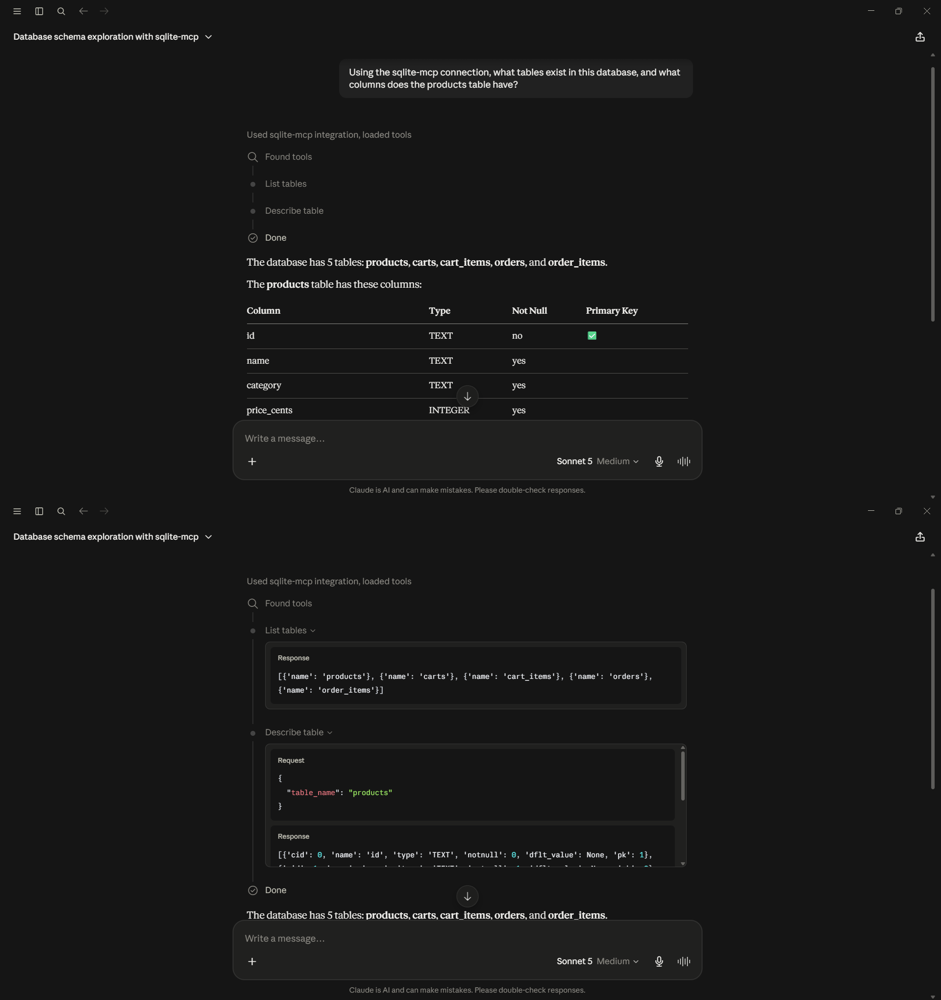

# Claude DB Connect

Claude Desktop, wired up to talk to four different local databases — PostgreSQL, MySQL, MS SQL Server, and SQLite — through the Model Context Protocol (MCP). Ask it a question in plain English, and it queries the live database, reads the real schema, and writes real SQL to answer you. No mock data, no scripted responses.

Built as an internship project, and used as a practical excuse to get hands-on with MCP: how it's wired up, where the official guides fall short, and what it actually takes to get an AI assistant reading a live database instead of just talking about one.

**What makes this more than a copy-paste tutorial:** none of the four setups worked on the first try. The "official" Postgres MCP image runs the wrong protocol entirely, a recommended npm package turned out to be deprecated, an upstream SDK shipped a breaking change days before this was built, and a native Windows service was silently hijacking a port the whole time. Every one of those got diagnosed and fixed — the full story for each database is one click away in its [setup guide](#status).

Full build log and design decisions: see [PLAN.md](./PLAN.md).

## Architecture

**Phase 1a — Docker + Claude Desktop (PostgreSQL)**
```
Claude Desktop  --MCP (stdio, via uvx)-->  postgres-mcp  --SQL-->  Postgres (Docker, port 5433)
```

For full setup instructions for `PostgreSQL`, see [`PostgreSQL` setup guide](docs/setup/postgres.md).

**Phase 1b — Docker + Claude Desktop (MySQL)**
```
Claude Desktop  --MCP (stdio, via uvx)-->  mysql-mcp  --SQL-->  MySQL (Docker, port 3306)
```

For full setup instructions for `MySQL`, see [`MySQL` setup guide](docs/setup/mysql.md).

**Phase 1c — Docker + Claude Desktop (MS SQL Server)**
```
Claude Desktop  --MCP (stdio, via pip-installed sql-mcp-server)-->  sql-assistant  --SQL-->  SQL Server (Docker, port 1433)
```

For full setup instructions for `MS SQL Server`, see [`MS SQL Server` setup guide](docs/setup/mssql.md).

**Phase 1d — Claude Desktop (SQLite)**
```
Claude Desktop  --MCP (stdio, via uvx)-->  sqlite-mcp  --SQL-->  SQLite (local file, no container)
```

For full setup instructions for `SQLite`, see [`SQLite` setup guide](docs/setup/sqlite.md).

## Status

All four databases are wired up and validated end-to-end — click a link below for that database's full setup walkthrough, including everything that broke along the way.

- [x] Plan written
- [x] [Phase 1a: Docker + Claude Desktop (PostgreSQL)](docs/setup/postgres.md) — **working**, validated end-to-end
- [x] [Phase 1b: Docker + Claude Desktop (MySQL)](docs/setup/mysql.md) — **working**, validated end-to-end
- [x] [Phase 1c: Docker + Claude Desktop (MS SQL Server)](docs/setup/mssql.md) — **working**, validated end-to-end
- [x] [Phase 1d: Claude Desktop (SQLite)](docs/setup/sqlite.md) — **working**, validated end-to-end

## Showcase Screenshots

Proof it's real: one live query-result screenshot per database, straight from Claude Desktop's tool-call panel — see each database's setup guide for the full validation set (schema, aggregation, top-query, and code-generation prompts, all run live).

**PostgreSQL** — *"What columns does the employees table have?"*
[](docs/screenshots/postgres/phase1_query_schema.png)
See [`PostgreSQL` setup guide](docs/setup/postgres.md) for the full validation set.

**MySQL** — *"What columns does the employees table have?"*
[](docs/screenshots/mysql/mysql_query_schema.png)
See [`MySQL` setup guide](docs/setup/mysql.md) for the full validation set.

**MS SQL Server** — *"What columns does the employees table have?"*
[](docs/screenshots/mssql/mssql_query_schema.png)
See [`MS SQL Server` setup guide](docs/setup/mssql.md) for the full validation set.

**SQLite** — *"What columns does the employees table have?"*
[](docs/screenshots/sqlite/sqlite_query_schema.png)
See [`SQLite` setup guide](docs/setup/sqlite.md) for the full validation set.

## Security Notes

- `POSTGRES_READ_ONLY` is enforced at the MCP wrapper level, not by Postgres itself — a more rigorous setup would use a dedicated read-only Postgres role via `GRANT SELECT`. Called out here deliberately: knowing the limits of a control is as important as having it.
- No real credentials are committed — see `.env.example` and `.gitignore`.
- See [PLAN.md](./PLAN.md) Section 8 for the full security write-up.

## License

MIT (or update as preferred).
