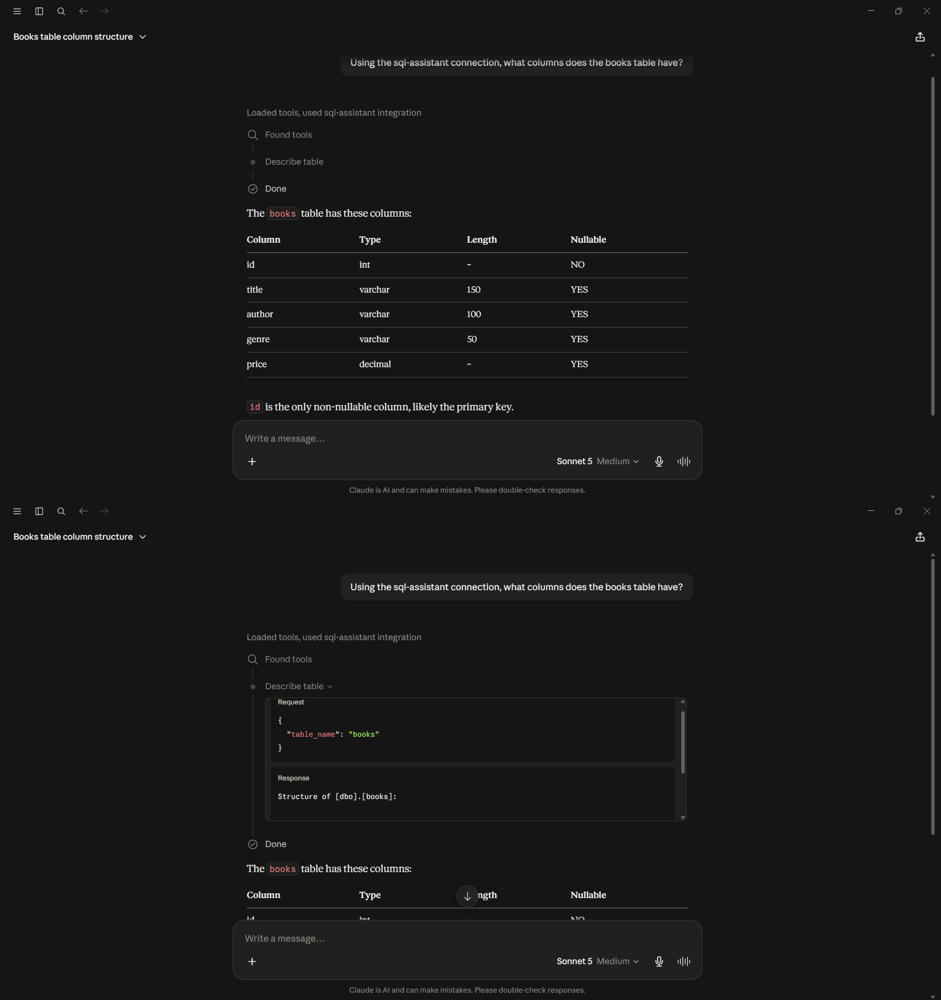
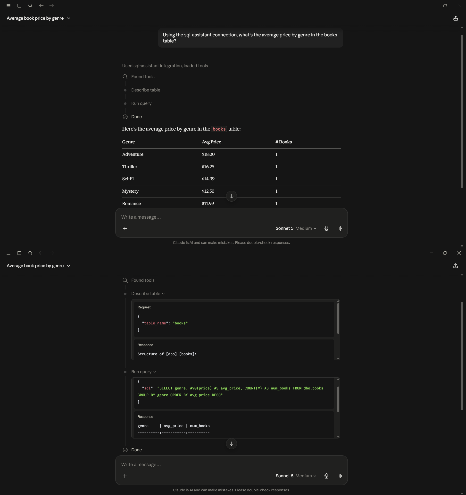
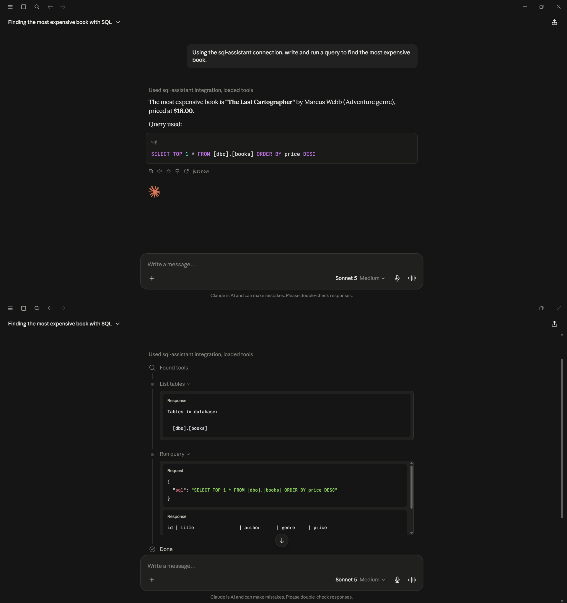
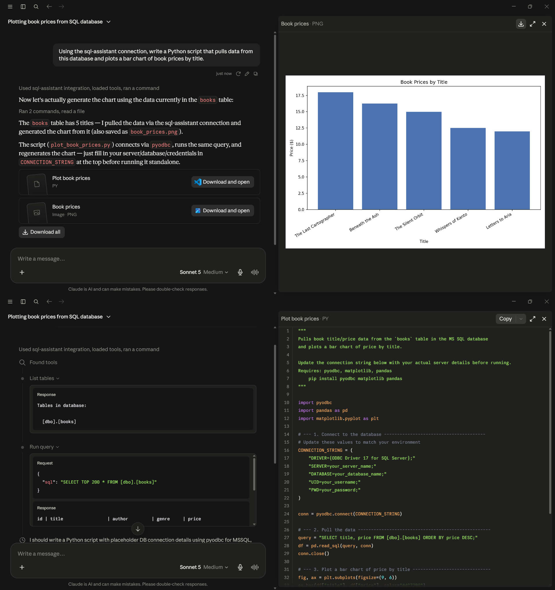

# MS SQL Server Setup Guide

[← Back to main README](../../README.md)

## Architecture

**Phase 1c — Docker + Claude Desktop (MS SQL Server)**
```
Claude Desktop  --MCP (stdio, via pip-installed sql-mcp-server)-->  sql-assistant  --SQL-->  SQL Server (Docker, port 1433)
```

## Setup

1. Start the SQL Server container:
   ```
   docker run -d --name local-mssql -e "ACCEPT_EULA=Y" -e "MSSQL_SA_PASSWORD=<YOUR_PASSWORD>" -p 1433:1433 mcr.microsoft.com/mssql/server:2022-latest
   ```
   Give it ~30 seconds to finish initializing before connecting.

2. Install the **ODBC Driver 17 for SQL Server** on the host machine — required by pyodbc, which the MCP server uses to talk to SQL Server. See https://learn.microsoft.com/en-us/sql/connect/odbc/download-odbc-driver-for-sql-server — note it requires admin/UAC elevation.

3. Seed the schema — see `../../sql/mssql/books_schema.sql`.

4. Install the MCP server **directly via pip, not uvx**:
   ```
   pip install sql-mcp-server
   pip install "mcp<2.0.0" --force-reinstall
   ```

5. Add the contents of `../../config/mssql/claude_desktop_config.example.json` to the `mcpServers` key in Claude Desktop's config, filling in your real SA password.

6. Fully quit and reopen Claude Desktop, confirm `sql-assistant` shows status **running** in Settings → Developer.

## Gotchas

**Note** — if you see `ModuleNotFoundError: No module named 'mcp.server.fastmcp'`, that's pip's Python dependency resolution pulling in `mcp` 2.0.0 instead of the 1.x line `sql-mcp-server` expects — the `pip install "mcp<2.0.0" --force-reinstall` in step 4 pins it.

## Validation Screenshots

The same 4 prompts, run live against SQL Server:

[](../screenshots/mssql/mssql_query_schema.png)
[](../screenshots/mssql/mssql_query_aggregation.png)
[](../screenshots/mssql/mssql_query_topquery.png)
[](../screenshots/mssql/mssql_query_codegen.png)
