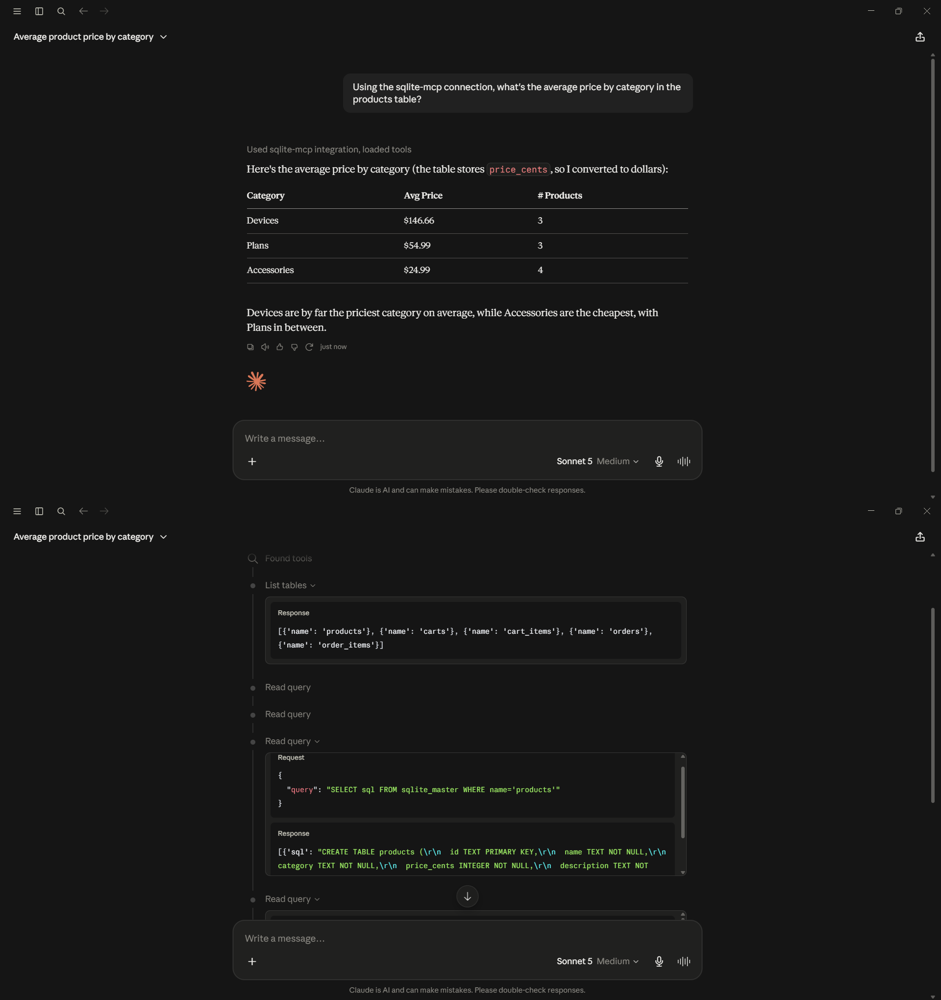
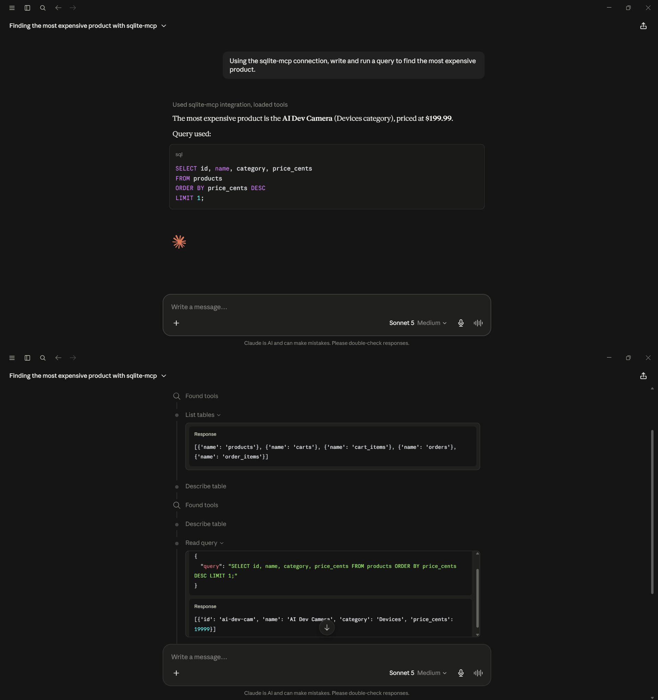
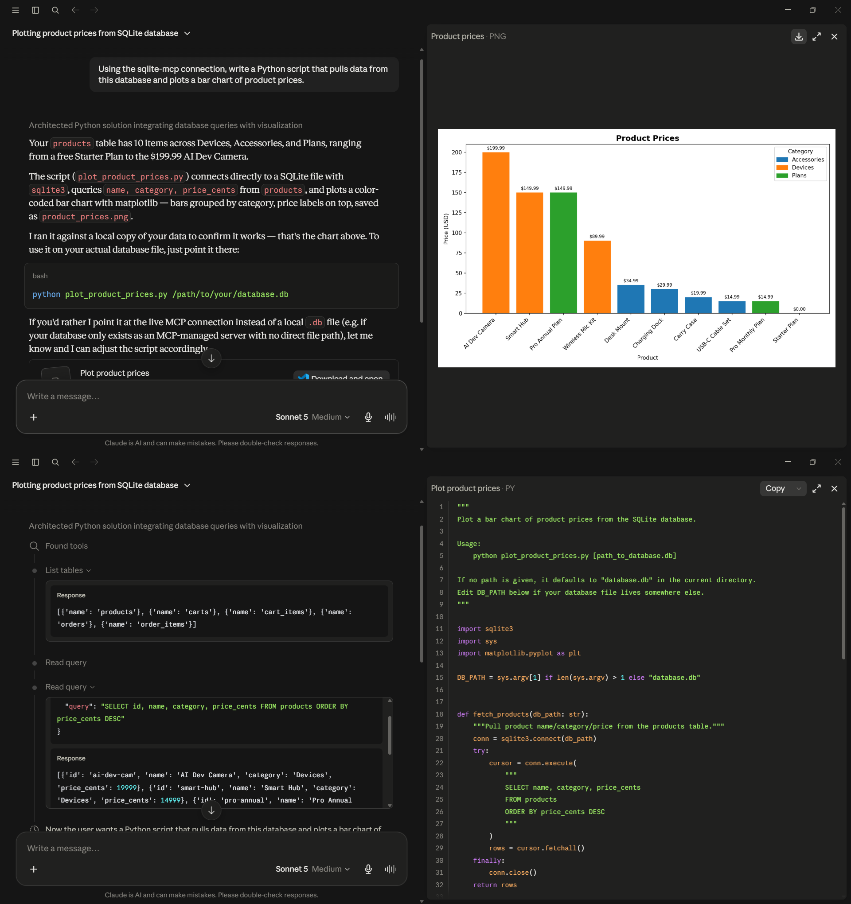

# SQLite Setup Guide

[← Back to main README](../../README.md)

## Architecture

**Phase 1d — Claude Desktop (SQLite)**
```
Claude Desktop  --MCP (stdio, via uvx)-->  sqlite-mcp  --SQL-->  SQLite (local file, no container)
```

## Setup

The simplest of the four — no Docker container, no server process, just a local file.

1. No database server to start — SQLite is just a file on disk. Point the config at an existing `.db` file, or create a new empty one.

2. See `../../sql/sqlite/store_schema.sql` for an example schema (a small e-commerce checkout dataset — products, carts, cart_items, orders, order_items) usable to create a sample database.

3. Add the contents of `../../config/sqlite/claude_desktop_config.example.json` to the `mcpServers` key, setting `--db-path` to the actual `.db` file.

4. Fully quit and reopen Claude Desktop, confirm `sqlite-mcp` shows status **running** in Settings → Developer.

## Gotchas

**Note** — there's no "start the database" step at all since SQLite has no server process — the whole database is just the file itself. Never commit your actual `.db` file to version control if it contains real or sensitive data; keep it local only and add it to `.gitignore`.

## Validation Screenshots

The same 4 prompts, run live against SQLite:

[](../screenshots/sqlite/sqlite_query_schema.png)
[](../screenshots/sqlite/sqlite_query_aggregation.png)
[](../screenshots/sqlite/sqlite_query_topquery.png)
[](../screenshots/sqlite/sqlite_query_codegen.png)
